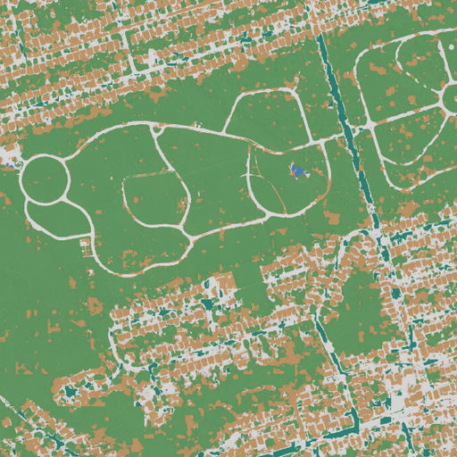
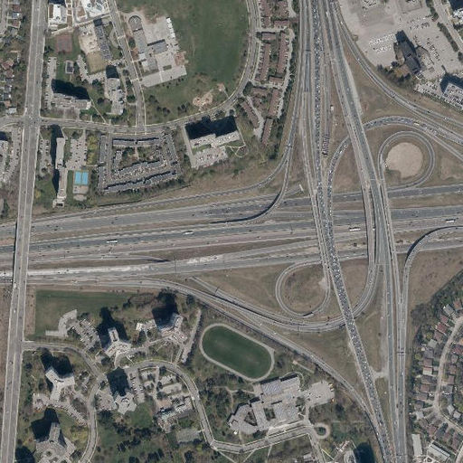

# High-Resolution ML-Automated Land Use Classification at Scale in Toronto

## Overview (TL;DR)
>This project demonstrates a scalable automated machine learning pipeline to classify land use/land cover (LULC) for the entire City of Toronto (~630 km²) from high-resolution aerial imagery.
>
>Using a custom-trained U-Net model and automation, the system slices, predicts, merges, and tiles results for web deployment. The output is a navigable map showing how AI can accelerate LULC mapping — useful for planning, environmental monitoring, and more.
---
## Live Demo
🗺️ **Check out the [Map Demo](https://connorcrowe.github.io/to-lulc-scale/)**


---
## The Importance of Automated LULC
Land use maps are crucial for climate resilience, urban planning, and infrastructure decisions. Manual mapping is slow and expensive. This project shows that city-wide LULC classification automated and deployed with open tools and data — making real-time, high-resolution urban monitoring feasible.

Land use maps are crucial for informing climate resilience, urban planning, infrastructure and more. However manually creating accurate maps is slow and resource intensive. This project is an attempt at automated LULC classification that leverages machine learning to bring down the time to insight.

## Project Goal & Approach
This project set out to:
- Build an end-to-end machine learning pipeline for LULC prediction from aerial imagery.
- Scale the system to cover all of Toronto without sacrificing resolution.
- Handle large data volumes via automation.
- Deploy results in an interactive, intuitive way.

Approach:
- Downloaded aerial tiles from Toronto's MapServer service.
- Used a custom U-Net model trained on manually-labelled samples.
- Automated prediction + post-processing into a usable GeoTIFF format and map image tiles.
- Deployed the results using a lightweight web map.

### Pipeline
1. **Slicer**: Downloads specific size and resolution of spatially aligned image tiles from the City of Toronto map server.
2. **Predictor**: Breaks tiles into overlapping patches, runs trained CNN and blends predictions.
3. **Processing**: Converts predictions to GeoTIFF, colourizes them and tiles them for web deployment.
4. **WebMap**: Displays results in fast, interactive leaflet-based map viewer.

```mermaid
flowchart LR
    A[City of Toronto Aerial Imagery<br>via map server] --> B[Slicer<br>→ 352x352m, 704x704px Tiles]
    B --> C[Patch Generator<br>→ 128x128px Overlapping Patches]
    C --> D[Prediction Model<br>U-Net Classifier]
    D --> E[Post-Processor<br>→ Merged Prediction Tiles<br>→ Colorized GeoTIFF<br>→ Zoomable Web Tiles]
    E --> F[WebMap Viewer<br>Leaflet + Vite App]
```



### Prediction Model
The classifier is a u-net convolutional neural network trained on manually labelled training aerial images of Toronto. 
More info about how the model was built and other models explored here **[#to-lulc-aiml](https://github.com/connorcrowe/to-lulc-aiml)**.

**Training**
- Trained on 128x128 pixel, 64x64 meter overlapping aerials 
- Significant data augmentation to expand training set
- 5 Classes (road, pavement, building, vegetation, water)

**Architecture**
- 4 Layer U-Net 
- 4 convolutional layers, a bottleneck, and 4 up-convolutional layers with skip connections

```mermaid
flowchart LR
    subgraph Encoder
        A[Input<br>128×128×3] --> B1[ConvBlock + MaxPool<br>64 filters]
        B1 --> B2[ConvBlock + MaxPool<br>128 filters]
        B2 --> B3[ConvBlock + MaxPool<br>256 filters<br>5×5 kernel]
        B3 --> B4[ConvBlock + MaxPool<br>512 filters<br>5×5 kernel]
    end

    subgraph Bottleneck
        B4 --> BN[Bottleneck<br>1024 filters<br>5×5 kernel]
    end

    subgraph Decoder
        BN --> U4[UpSample + Concat B4<br>→ ConvBlock 512]
        U4 --> U3[UpSample + Concat B3<br>→ ConvBlock 256]
        U3 --> U2[UpSample + Concat B2<br>→ ConvBlock 128]
        U2 --> U1[UpSample + Concat B1<br>→ ConvBlock 64]
        U1 --> O[Output<br>1×1 Softmax<br>5 classes]
    end

    %% Skip Connections
    B1 --skip--> U1
    B2 --skip--> U2
    B3 --skip--> U3
    B4 --skip--> U4
```



### Work & Tools
**Custom-Built**:
- *Slicer script*: downloads specific tiles of aerial imagery from City of Toronto map server
- *Training data*: manually classified aerial samples for model training/testing
- *Classification model*: U-Net architecture CNN
- *Predictor script*: Automated batch prediction using classification model
- *Web map setup*: Lightweight frontend to display results

**Used/Leveraged**:
- *Aerial imagery*: City of Toronto ArcGIS REST Services Directory, COT Ortho 2023 Color 10cm MapServer
- *Raster processing*: `rasterio`, `numpy`
- *Classification model*: Keras, TensorFlow
- *GeoTIFF, COG, Tiling*: `gdal`
- *Web map*: Vite, Leaflet.js, OpenStreetMap

## Results
**Strengths**
| Strength | Description | Example |
| :- | - | - |
| ***Row Homes & Grids*** | Model predicts grids aligned with typical Toronto grid pattern and row home on them well. (There was much of this pattern in the training data) | |
| ***Parks & Paths*** | Green spaces predicted consistently, with distinct paths within them | |
| ***Water & Breakwaters*** | Despite few training examples, strong prediction on most water and nearly all breakwaters | |

**Issues**
| Issue | Reason | Fix | Example |
| :- | - | - | - |
| ***Missing aerials*** | When requesting aerials from the server some returned with incomplete data or errors. | Implement auto-retry into the slicer for failed slices ||
| ***Water Shades*** | While water was present in the dataset, shallow beach water, deep water, and water reflecting sunlight directly were not. The model gets confused in varied water with darker blue colours. | Add more varied water examples to training data ||
| ***Expressways*** | There were no expressway examples in the training set. The model correctly differentiates these highways from their surroundings, but misclassifies them as buildings. | Add expressway examples to  training data ||

## Impact & Use Cases
Imagery and raw geospatial data grows every day and contains information useful to tackling some of the world's greatest challenges. Insights from them can empower planners, policy makers and more to tell compelling geospatial stories to solve problems --- but those insights require processed information like high-resolution land cover maps, which are resource intensive and slow to produce when done manually. 

An automated approach can drastically reduce the time to results.

With some human correction and further model tuning, automated LULC would unlock accurate, up-to-date, normalized and affordable insights for several industries.

#### **Urban Planning & Infrastructure**
- **Impervious surfaces** in a city play a large role in managing heavy rainfall and flood planning, but can change significantly year over year. Automated mapping allows for maps to capture these changes so planners can plan accordingly.
- **Informing planners** to help with transportation planning, zoning updates, density studies, land use optimization, and more.

#### **Climate Resilience**
- **Urban heat islands** that threaten cities are influenced by vegetation, water features and emissive surfaces city wide. Accurate and updated maps allows planners to track and improve heat vulnerable areas
- **Insight for climate adaptation** insight at scale for all levels of government to support with monitoring tree canopy, or modeling stormwater runoff and more. Automating this allows near real-time environmental insights.

#### **Public Communications, Insurance, Telecom, and More**
- Visual results bridge the gap between technical output and stakeholder insight. Anyone—from policymakers to analysts—can visually explore, add industry-specific insight, and leverage geospatial knowledge in context.

## Appendices
**Future Work**
1. Implement auto-retry logic in slicer to avoid missing failed tiles
2. Expand variety of grid patterns, water types, and roadway types in training set
3. Convert post-processing to automated script

**Data Source**
Aerial Imagery (2023 color 10cm) sourced from [City of Toronto ArcGIS REST Services Directory Map Server](https://gis.toronto.ca/arcgis/rest/services/basemap)
This project was written for personal use. 
All data used is open and publicly accessible.

**Repo Structure**
```
to-lulc-scale/
|-- data/               # WMS tiles and predicted tiles
|-- model/              # Trained models
|-- scripts/
|   |-- slicer.py       # Slice WMS into tiles
|   |-- predictor.py    # Predict lulc on slices
|-- webmap/             # For visualising results 
|-- notebooks/          # Experiments & testing
```